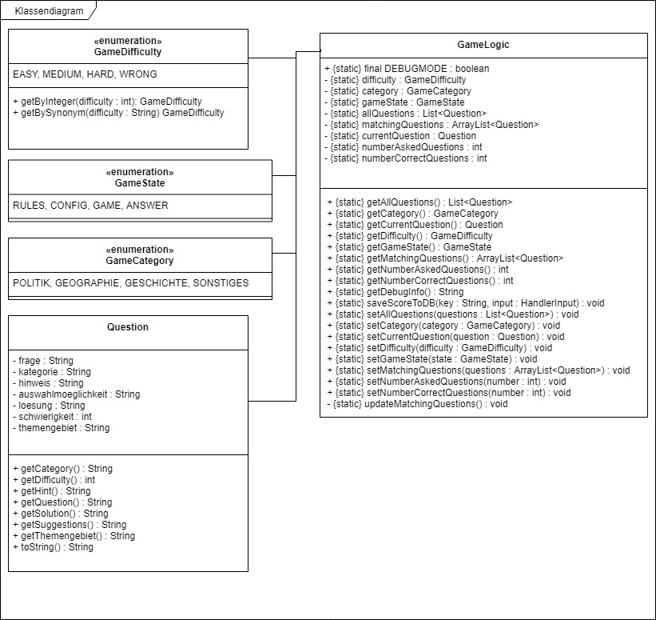

# Systemidee
Der Alexa Skil "Test your Brain" ist ein Allgemeinwissenstest für Jung und Alt. Aufgrund von oft fehlender Allgemeinbildung ist uns die Idee gekommen, einen Allgemeinwissens test aufzubauen. Dieser kann unterwegs und zuhause durchgeführt werden.

Dank Alexa ist es uns möglich, per Sprachsteuerung zu spielen. Was zum Beispiel den Vorteil bringt das Spiel neben dem Kochen, Auto fahren oder neben dem morgendlichen fertig machen im Bad zu spielen und so eine bessere Allgemeinbildung zu erhalten.

Dafür stellt uns Alexa Fragen in verschiedenen Schwierigkeitsgraden und aus diversen Kategorien. Durch häufiges spielen kann man herausfinden, auf welchem Stand sich das eigene Allgemeinwissen befindet und ob man eventuell durch das häufigere Spielen sein Wissen erweitert. Richtige Antworten bestätigen das eigene Niveau, falsche wiederum, belehren den Nutzer mit neuem Wissen.

Über ein Highscore kann man den eigenen Lernfortschritt schließlich betrachten.
# Funktionsweise
1. Zu Begin des Spiels wird dem Spieler die Möglichkeit gegeben sich die Spielregeln erklären zu lassen. 
2. Anschließend muss der Spieler zwischen den Schwierigkeiten _Leicht_, _Mittel_ und _Schwer_ entscheiden.
3. Nun muss der Spieler noch eine Kategorie wählen. Er kann zwischen _Geschichte_, _Geografie_, _Politik_ und _Sonstiges_ wählen.
4. Mit _nächste Frage_ kann der Spieler sich jetzt die Erste Frage aus der gewählten Schwierigkeit und Kategorie ausgeben lassen.
5. * Mit _antwort a_,_antwort b_ oder _antwort c_ wählt der Spieler eine der Anwortmöglichkeiten aus.
   * Der Spieler hat aber auch die Möglichkeit sich eine Hinweis ausgeben zu lassen. Dafür muss er _hilfe_ sagen.
   * Falls der Spieler sich bei den Antwortmöglichkeiten nicht sicher ist, kann er auch die Frage wiederholen lassen. Dafür muss er _wiederholung_ sagen.
6. Nach einer eingegenben Antwort, ertönt ein Signalton und der Spieler bekommt eine Mitteilung ob seine Antwort Richtig oder Falsch war.
7. Sollte der Spieler nun die Schwierigkeit oder Kategorie wechseln wollen, kann er das einfach über _wechsle Schwierigkeit zu [schwer]_ oder _wechsle Kategorie zu [Politik]_. 
Das ist auch notwendig, falls in der gewählten Kategorie und Schwierigkeit keine Fragen mehr vorhanden sind.

# Buisnesslogic

